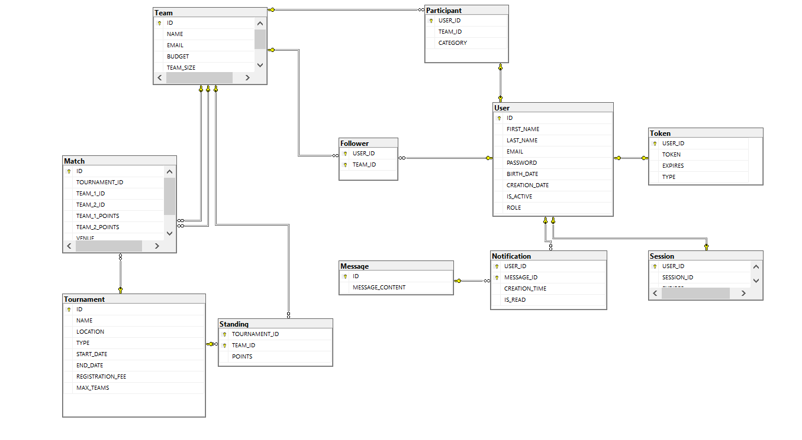

# dev-ops-project-fmi
Git repository for the project in the DevOps course at FMI

## Branching strategy for this project
The branches in this repository will be organized in the following way:
- `main` - for stable versions of the project
- `dev` - for versions in development (stability is not guaranteed)
- `feature/...` - for working versions from the `dev` branch

## Sports Tournament Organizer

This project is a Sports Tournament Organizer application designed to manage tournaments, teams, participants, matches, and notifications. It provides a comprehensive platform for organizing and tracking sports events.

### Table of Contents

- [Features](#features)
- [Technology Stack](#technology-stack)
- [Database Schema](#database-schema)
- [API Endpoints](#api-endpoints)
- [Getting Started](#getting-started)
    - [Prerequisites](#prerequisites)
    - [Installation](#installation)
    - [Running the Application](#running-the-application)
- [Usage](#usage)
- [Contributing](#contributing)
- [License](#license)

### Features

The application implements the following core functionalities based on the business requirements:

* **Tournament Management**
    * Create, edit, and delete tournament details (e.g., sport type, dates, locations, rules)
    * Invite teams and manage registration
* **Match Scheduling and Results Tracking**
    * Schedule matches and assign venues.
    * Update and track match results and team standings.
    * Provide live updates and notifications to teams and followers.
* **Participant and Team Management**
    * Register participants and manage team rosters.
    * Categorize teams and participants (e.g., amateur, professional, youth).
    * Send tournament schedules, updates, and results via email or platform notifications.
* **Participant Authentication and Profile Management**
    * Secure participant registration and login.
    * Personal and team profile management.
    * Email verification and password recovery.

### Technology Stack

* **Java**: Core programming language.
* **Spring Boot**: Framework for building the application.
* **Maven**: Dependency management and build automation.
* **MySQL** (or other relational database): For data persistence.
* **JPA/Hibernate**: ORM for database interaction.
* **Lombok**: To reduce boilerplate code.
* **Postman**: For API testing and documentation.

### Database Schema

The database schema is designed to support the functionalities described above. Below is an overview of the entities and their relationships:



* **User**: Stores user information, including authentication details and personal profiles.
* **Token**: Manages user session tokens for authentication and password recovery.
* **Team**: Represents a sports team with details like name, email, budget, and size.
* **Participant**: Links Users to Teams, indicating a participant's membership in a team and their category (e.g., amateur, professional).
* **Tournament**: Stores tournament details such as name, location, type, dates, registration fee, and maximum number of teams.
* **Match**: Records individual matches within a tournament, including participating teams, points, and venue information.
* **Standing**: Tracks team standings within a tournament, including points.
* **Follower**: Associates Users with Teams they are following to receive updates.
* **Message**: Stores messages for communication within the platform.
* **Notification**: Manages notifications sent to users, indicating message content, creation time, and read status.
* **Session**: Represents active user sessions.

### API Endpoints

The API is structured around RESTful principles. Below are some of the key endpoints. For a complete list and detailed request/response examples, refer to the `Sports-Tournament-Organizer.postman_collection.json` file.

#### Tournaments

* `POST /api/tournaments` - Create a new tournament.
* `GET /api/tournaments` - Get all tournaments.
* `GET /api/tournaments/{id}` - Get a tournament by ID.
* `PUT /api/tournaments` - Update an existing tournament.
* `DELETE /api/tournaments/{id}` - Delete a tournament.
* `POST /api/tournaments/{tournamentId}/teams` - Register a team for a tournament.
* `GET /api/tournaments/{tournamentId}/teams` - Get teams participating in a tournament.
* `DELETE /api/tournaments/{tournamentId}/teams/{teamId}` - Remove a team from a tournament.
* `GET /api/tournaments/{tournamentId}/standings` - Get tournament standings.

##### Matches (within a Tournament)

* `POST /api/tournaments/{tournamentId}/matches` - Schedule a new match.
* `GET /api/tournaments/{tournamentId}/matches` - Get all matches for a tournament.
* `GET /api/tournaments/{tournamentId}/matches/{matchId}` - Get a specific match by ID.
* `PATCH /api/tournaments/{tournamentId}/matches/{matchId}/results` - Update match results.
* `DELETE /api/tournaments/{tournamentId}/matches/{matchId}` - Delete a match.
* `PATCH /api/tournaments/{tournamentId}/matches/{matchId}/finished` - Mark a match as finished.

#### Teams

* `POST /api/teams` - Create a new team.
* `GET /api/teams` - Get all teams.
* `GET /api/teams/{id}` - Get a team by ID.
* `PUT /api/teams` - Update an existing team.
* `DELETE /api/teams/{id}` - Delete a team.

##### Participants (within a Team)

* `POST /api/teams/{teamId}/participants` - Register a participant for a team.
* `GET /api/teams/{teamId}/participants` - Get participants in a team.
* `GET /api/teams/{teamId}/participants/{participantId}` - Get a participant by ID.
* `PUT /api/teams/{teamId}/participants` - Update a participant's details.
* `DELETE /api/teams/{teamId}/participants/{participantId}` - Remove a participant from a team.

##### Followers (for a Team)

* `POST /api/teams/{teamId}/followers` - Subscribe a user to follow a team.
* `DELETE /api/teams/{teamId}/followers/{userId}` - Unsubscribe a user from following a team.
* `GET /api/teams/{teamId}/followers` - Get all followers for a team.

#### Users

* `POST /api/auth/register` - Register a new user profile.
* `POST /api/auth/login` - Authenticate and log in a user.
* `POST /api/auth/forgot-password` - Initiate password recovery.
* `PATCH /api/auth/reset-password` - Reset password using a token.
* `PATCH /api/auth/verify-email` - Verify user email using a token.
* `GET /api/profiles/me` - Get the current user's profile.
* `PUT /api/profiles/me` - Update the current user's profile.
* `DELETE /api/profiles/me` - Delete the current user's profile.

#### Notifications

* `GET /api/notifications` - Get all notifications for the current user.
* `GET /api/notifications/new` - Get all unread notifications for the current user.
* `DELETE /api/notifications` - Delete all notifications for the current user.
* `POST /api/notifications` - Send a notification from current user to another one.

### Getting Started

#### Prerequisites

* Java Development Kit (JDK) 17 or higher
* Maven 3.x
* A relational database (e.g., MySQL)
* Git

#### Installation

1.  **Clone the repository:**

    ```bash
    git clone [https://github.com/your-username/sports-tournament-organizer.git](https://github.com/your-username/sports-tournament-organizer.git)
    cd sports-tournament-organizer
    ```

2.  **Configure the database:**
    * Create a new database for the application.
    * Update `src/main/resources/application.properties` (or `application.yml`) with your database connection details:

        ```properties
        spring.datasource.url=jdbc:mysql://localhost:5432/your_database_name
        spring.datasource.username=your_username
        spring.datasource.password=your_password
        spring.jpa.hibernate.ddl-auto=update # or create, create-drop
        spring.jpa.show-sql=true
        ```

3.  **Build the project:**

    ```bash
    mvn clean install
    ```

#### Running the Application

You can run the Spring Boot application using Maven:

```bash
mvn spring-boot:run